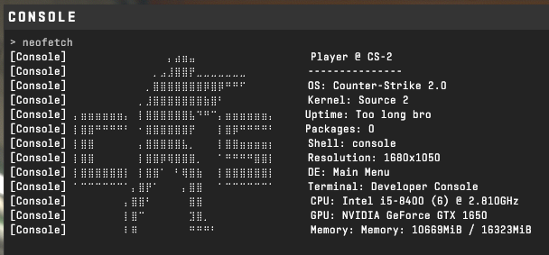

<h1><b>CS2 Neofetch</b></h1>
<h3> <a href="https://github.com/dylanaraps/neofetch">neofetch</a> for Counter-Strike, cuz why not</h3>

## About

A simple config (.cfg) file for CS2 that makes an alias for `neofetch` to make some echos. It should also work for any other source games that include a developer console.  
It does not include any system-detection software, so you will have to put your specs manually.

## Installation

The install instructions are included inside the `neofetch.cfg` file. There are different ways to get that file:  
1. Use the "download" button from [here](https://github.com/PepeBigotes/cs2-neofetch/blob/master/neofetch.cfg)
2. Copy-paste the [raw contents](https://raw.githubusercontent.com/PepeBigotes/cs2-neofetch/master/neofetch.cfg) of the file manually
3. Clone the whole repo using `git clone`
